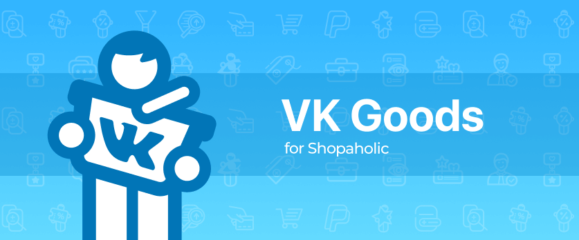

# VK Goods for Shopaholic

[](https://travis-ci.org/oc-shopaholic/oc-vk-goods-shopaholic-plugin) [](https://github.com/oc-shopaholic/oc-vk-goods-shopaholic-plugin) [](https://coveralls.io/github/oc-shopaholic/oc-vk-goods-shopaholic-plugin?branch=master) [](https://codeclimate.com/github/oc-shopaholic/oc-vk-goods-shopaholic-plugin/maintainability) [](https://crowdin.com/project/oc-vk-goods-shopaholic-plugin) [](https://www.gnu.org/licenses/gpl-3.0)

Free extension for [Shopaholic](https://github.com/oc-shopaholic/oc-shopaholic-plugin) #1 e-commerce ecosystem for [October CMS](https://octobercms.com).



Extend your sales to the audience of the most popular Russian social media [vk.com](https://vk.com) using **VK Goods for Shopaholic** plugin.

## Overview

This plugin allows to:
* **sync products** with your business or community page **using [VK API](https://vk.com/dev/market)**;
* control **synchronization** process using **GUI** or **CLI**;
* **optimize** synchronization process **using queues**.

## Installation

You can install this plugin using October CMS backend Dashboard or by adding them to the registered project in your October CMS Marketplace profile.

You can find CLI way below to install the plugin.

### Artisan

Using the Laravel’s CLI is the fastest way to get started. Just run the following commands in a project’s root directory:

```bash
php artisan plugin:install Lovata.VkGoodsShopaholic
```

### Composer

Will be added soon.

## Configuration

Go to `Settings` > `Export to VK Goods` to configure the plugin.

You can export catalog this ways:
  
1. using widget `Export catalog to VK Goods` on the October CMS dashboard;
2. by runnung `shopaholic:catalog_export.vkgoods` artisan command.

## Live demo

You can try out this plugin on our [demo site](http://demo.shopaholic.one). Sign in to [backend](http://demo.shopaholic.one/backend) using the following credentials:
* user: manager
* password: manager

## What is Shopaholic?

Shopaholic is free most popular e-commerce ecosystem for October CMS, which admitted as **Editor's choice** rank.
It follows the similar philosophies of October CMS and Unix like operating systems, where the main focus is to create simple microarchitecture solutions that communicate with each other through smart APIs.

One one hand, this approach allows keeping performance, security, and functionality of the code to a high standard.
On the other hand, it provides a clean and smooth back-end UI/UX that isn't over-bloated with the features.

You're welcome to visit official website [shopaholic.one](shopaholic.one)! 

## Quality standards

We ensure the high quality of our plugins and provide you with full support. All of our plugins have extensive documentation.
The quality of our plugins goes through rigorous testing, we have launched automated testing for all of our plugins.
Our code conforms with the best writing and structuring practices.
All this guarantees the stable work of our plugins after they are updated with new functionality and ensures their smooth integration.

## Get involved

If you're interested in the improvement of Shopaholic project you can help in the following ways:
* bug reporting and new feature requesting by creating issues on plugin [GitHub page](https://github.com/lovata/oc-shopaholic-plugin/issues);
* contribution to a project following these [instructions](https://github.com/oc-shopaholic/oc-vk-goods-shopaholic-plugin/master/CONTRIBUTING.md);
* localization to your language using [Crowdin](https://crowdin.com/project/oc-vk-goods-for-shopaholic-plugin) service.

Let us know if you have any other questions, ideas or suggestions! Just drop a line at [info@shopaholic.one](mailto:info@shopaholic.one).

## License

© 2019, [LOVATA Group, LLC](https://github.com/lovata) under [GNU GPL v3](https://opensource.org/licenses/GPL-3.0).

Originally developed by [Sergey Zakharevich](https://github.com/wobqqq) and [Andrey Kharanenka](https://github.com/kharanenka).

